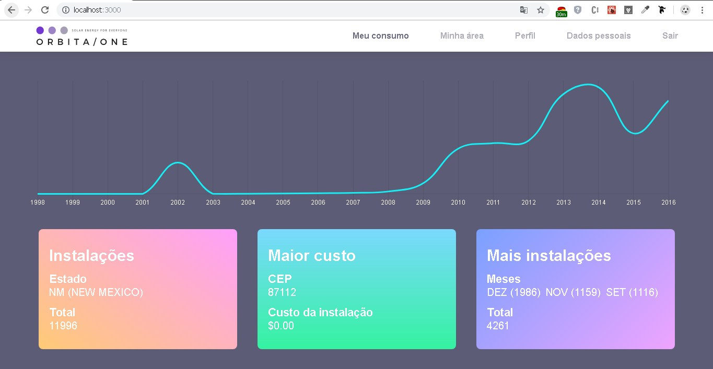

# Orbita Frontend

> Desafio de frontend para a vaga de Software Developer da Orbita Energy.

## Instalação

1 - Instalar e rodar o backend => https://github.com/renanbrenovital/orbita-frontend.git

## Iniciar

1 - Rodar o comando:

`yarn start`

Aplicação ficará diponível em => `http://localhost:3000`

## Testes

2 - Rodar o comando:

`yarn test`
